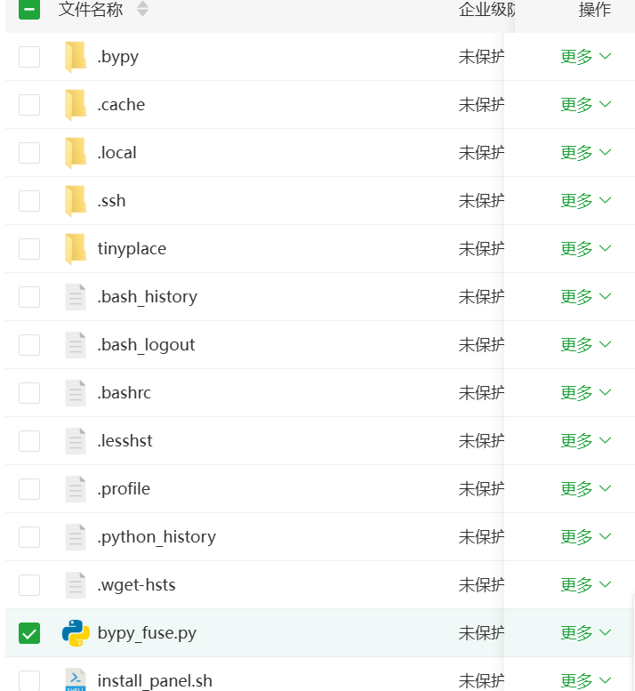
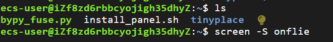
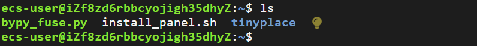
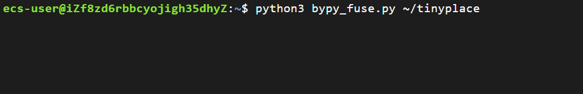
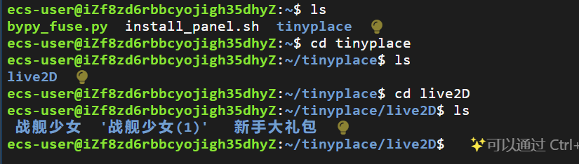
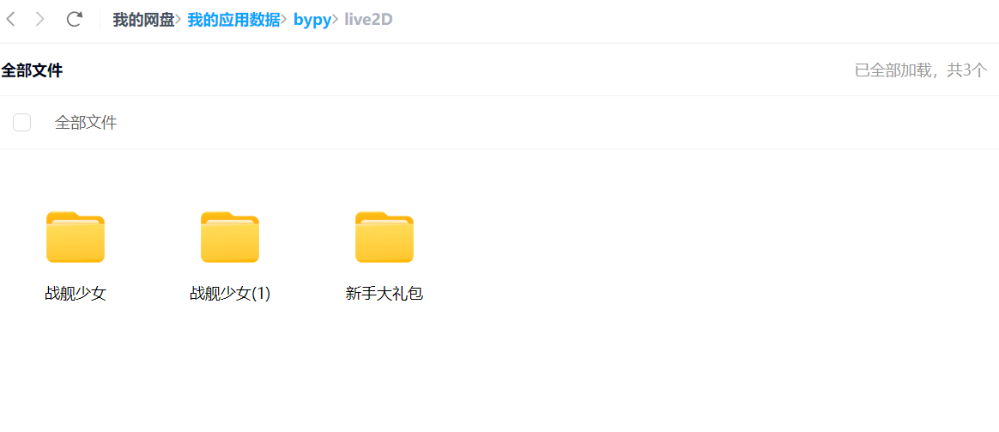
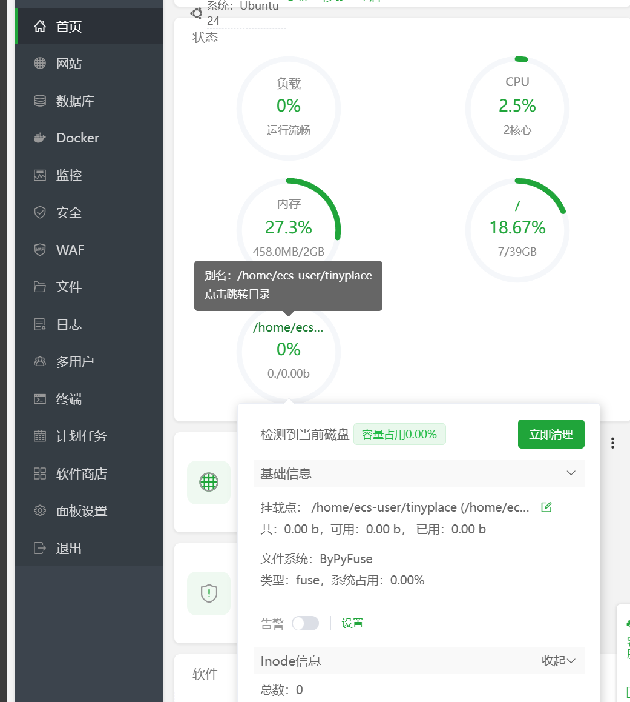
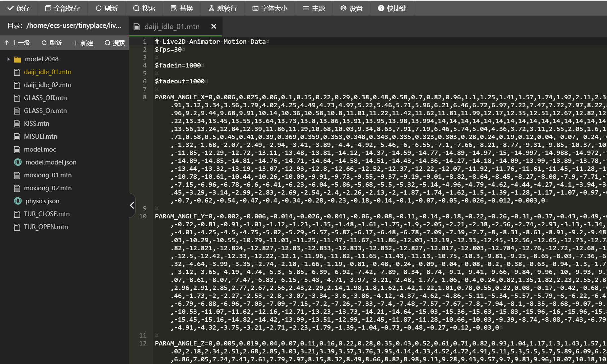

# tiny_bypy_floder
目的：将百度网盘挂载为服务器目录
基于 fusepy 和 bypy 的简易版只读文件系统实现，用于将百度网盘挂载到本地目录。
当前仅实现基础功能（列出文件、读取文件）

### 1. 准备工作
安装依赖：
### plan1
```bash
pip install fusepy bypy
sudo apt-get install fuse  # 确保系统支持FUSE
```
可能问题：安装了宝塔，或显示系统仅支持apt，可以用pipx进行安装如下plan2
### plan2
```bash
sudo apt-get install pipx
pipx install fuse bypy
sudo apt-get install python3-fusepy  # 这里因为是个库，不能用pipx
```
安装screen
```bash
apt install screen
```
初始化bypy
```bash
bypy init
```
终端会输出一个网址，在浏览器打开后，将复制的内容粘贴到终端后回车，等待即可
### 2.使用
将脚本扔到一处角落

创建并命名一个新的 screen 会话:

```bash
screen -S <session_name>  #<session_name>改为自己screen要用的名字，随意，我这里用的onfile
```
进入该脚本待的角落

运行脚本，挂载目录，这里我挂载的是同级别的tinyplace目录
```bash
python3 bypy_fuse.py ~/tinyplace #记得将~/tinyplace改为你要挂载的目录的路径
```

这就跑起来了
### 3.验证
重新开启一个终端，当前终端可叉掉


可以看到，我们将我的应用数据下的bypy目录，挂载在了tinyplace这个服务器目录上

宝塔上可看到挂了一个磁盘在这个目录

可直接读取文件数据,进行文件读操作
